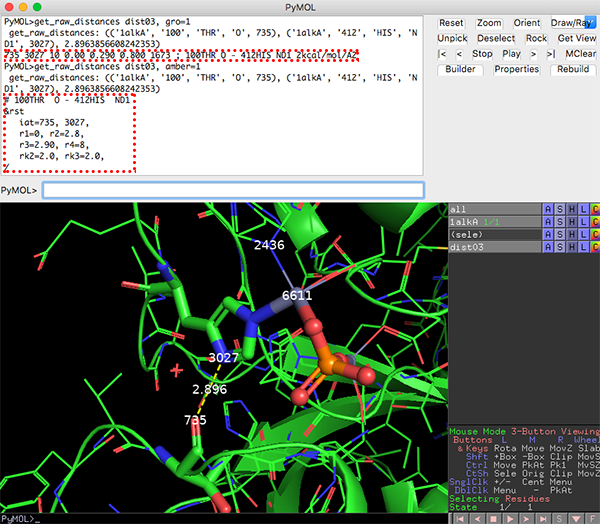

# psico
## インストール方法 ##
まず `git clone https://github.com/BILAB/psico.git` などで中のpsicoディレクトリをダウンロードしたあと、これについてのPATHをPyMOL側から通しておきます。例えば`~/apps`にpsicoディレクトリを置いた場合は、ホームディレクトリ以下に`~/.pymolrc`を作成して
```
# ~/appsはpsicoディレクトリの場所に合わせる
sys.path.append(os.path.expanduser('~/apps'))
import psico.fullinit
```
としておきます。この状態でPyMOLを立ち上げれば、`contactmap`を始めとしたpsicoの中のプラグインに由来する追加コマンドが使えるようになっているはずです。

## dssp表示 ##

DSSPによる二次構造判定の結果をPyMOLで表示させるためのプラグインです。`editing.py`の中に関数が定義されています。
PyMOLの窓に`help dssp`とすると、使い方が表示されます。
<pre>
def dssp(selection='(all)', exe='', raw='custom', state=-1, quiet=1, color=1):
    '''
DESCRIPTION

    Secondary structure assignment with DSSP.
    http://swift.cmbi.ru.nl/gv/dssp/

ARGUMENTS

    selection = string: atom selection {default: all}

    exe = string: name of dssp executable {default: mkdssp}

    raw = string: atom property to load raw dssp class into {default: 'custom'}

    color = string: color in response to secondary structure {default: 1/ON}
</pre>
使い方の例は`dssp <objectname>, color=0`みたいな感じ。`color=1`またはデフォルトでは、二次構造によって自動的に色付けを変更します。

使用にあたっては`mkdssp`コマンドがインストールされていることが条件です。`mkdssp`コマンドは、macOSの場合、

```
brew install brewsci/bio/xssp
```

でインストールできます(最近DSSPはxsspパッケージに統合されました)。CentOSの場合は

```
yum install dssp
```

でいけます。もし`mkdssp`をこれら以外の方法で`/usr/bin/`または`/usr/local/bin`以外のPATHにインストールした場合には、引数`exe`の部分にPATHを設定してあげてください。

</img>

## AMBER, GROMACS用距離拘束入力補助 ##

PyMOLでMDシミュレーションを眺めながら、「この原子とこの原子の間に距離拘束をかけたいな〜。でも、いちいち原子のIDを調べてポチポチ手入力するの面倒なんだよなあ。入力ミスも多いし、なんとかならないかな〜？」
そんなあなたにこの`get_raw_distances`コマンドがおすすめ（`querying.py`の中に関数定義してあります）！使い方は、まずCtrl+ホイールクリックを使って、distanceオブジェクトを生成した後、PyMOLの画面から

```
get_raw_distances dist01, amber=1(, gro=1)
```

のコマンドを入力すれば、`dist01`オブジェクトで結んだ2点間の距離拘束命令を書き出してくれます！

```
PyMOL>get_raw_distances dist01, amber=1
 get_raw_distances: (('1alkA', '100', 'THR', 'O', 735), ('1alkA', '412', 'HIS', 'ND1', 3027), 2.8963856608242353)
# 100THR  O - 412HIS  ND1
&rst
   iat=735, 3027,
   r1=0, r2=0.5,
   r3=2.90, r4=8,
   rk2=2.0, rk3=2.0,
/

PyMOL>get_raw_distances dist01, gro=1
 get_raw_distances: (('1alkA', '100', 'THR', 'O', 735), ('1alkA', '412', 'HIS', 'ND1', 3027), 2.8963856608242353)
735 3027 10 0.00 0.290 0.800 1673 ; 100THR O - 412HIS ND1 2kcal/mol/A2
```

AMBERの距離拘束を書き出したいときは`amber=1`を、GROMACSの距離拘束を書き出したいときは`gro=1`を、それぞれ指定します。詳しい使い方は`help get_raw_distances`コマンドを参照。オブジェクト名の指定を省略すれば、全distanceオブジェクトを対象に一気に表示してくれます。



## contactmap.py ##

PyMOLの窓に`help contactmap`とすると、使い方が表示されます。
<pre>
PyMOL>help contactmap

DESCRIPTION

    visualize the results from map_align algorithm in PyMOL.
    https://github.com/sokrypton/map_align

ARGUMENTS

    selection = string: atom selection {default: all}

    chain = string: chain ID you want to map {default: ''}

    align = string: name of map_align result txt file {default: 'hmmrenumbered.map'}

    pcut = float: probability cutoff to display {default: 0.999}

    offset = int: slide the sequence number to fit its original number manually {default: 0}

EXAMPLE

    contactmap 5dir, A, /path/to/hmmrenumbered.map, offset=-7
</pre>
`contactmap <object name>, <chain ID>`とし、適切に`newmap.txt`のパスを入れてやると動きます。`pcut`は表示させるときのProbabilityのカットオフ値です（Probabilityの低いものまで全部表示させていると大変なので）。`offset`は、PDBの番号とFASTAのナンバリングが合わない時にのみ、適当な整数値を与えてやってください。以下の図はPDB: 5DIRでやったときの図です。PDBのナンバリングととquery.faの残基数は7ずれていたため、`offset=-7`にしてあります。


こうしてみると、だいたいのCβ-Cβ距離は6~8 Å以内にあることがわかります。
